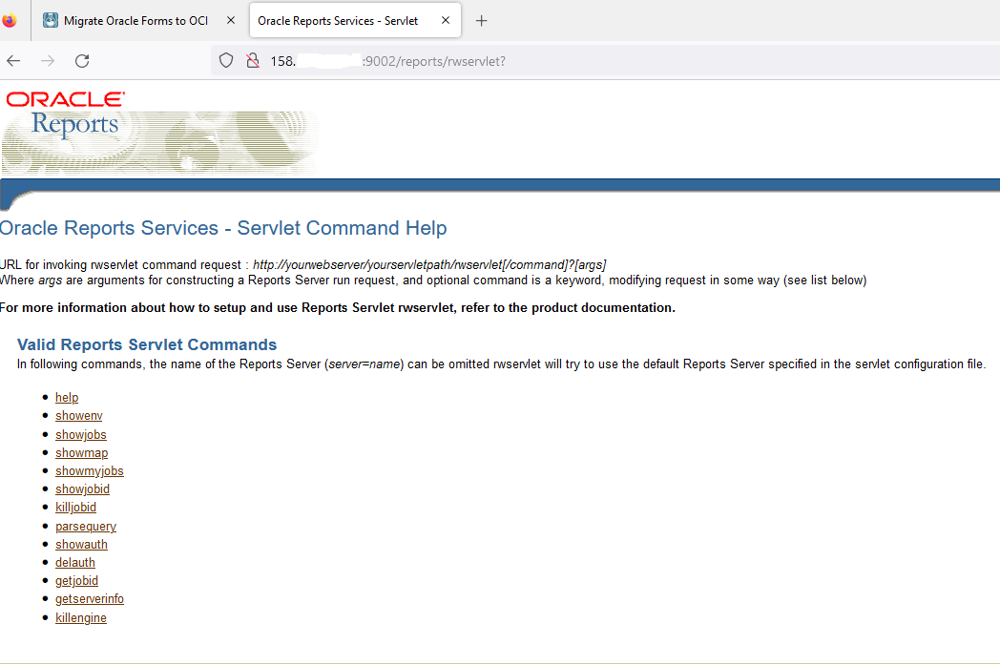

# Terraform Automation on Oracle Cloud : Create a Forms/Reports UC VM & Database CS (private network) and a Loab Balancer (public network) to access Forms and Reports

This project has been designed to run with Terraform. It will do 80% of the work automatically but at the end you have some manually steps (20%). These steps are needed to create the Wls Forms Domain on the Forms VM using the Oracle script and add Reports after on the domain because it is not installed in the default configuration.  

## Prerequisites

Clone the github repo...
Rename env-vars-template.ps1 to env-vars.ps1 and update all the parameters with your values.
Now you are ready.   

## Run the terraform stack

Run terraform plan and terraform apply to create the infrastructure :

<ul>
<li> VCN will be created (same result as the wizard in the oci cloud console</li>
<li> Database Cloud Service will be created in the private subnet</li>
<li> Forms UC VM (the last WebLogic Suite UC Image with Forms 12.2.1.19) will be created in the private subnet</li>
<li> Load Balancer Cloud Service will be create in the public subnet</li>
</ul>

Note : All ports for Forms and Reports and the Database are already opened in the good subnets. Double check that point in order to follow your own security rules. If needed update the terraform stack in the module "network". 

## Connect to the Forms VM using the Bastion Service

Create the bastion's session

Connect with SSH and Follow the Oracle script to configure the Forms Wls Domain. For that you need information from the database, mainly the PDB and be carefull not the CDB. You will find information on the Cloud Console on DBCS.

Note : 
Please at the end, when you will have the message "do you want to validate (y/N)" just press Enter.

Keep in mind all the passwords that you have used.

Examples : 
Vnc Password: LiveLab1
FMW Repository Schema password: LiveLab__123
WLS Admin password: LiveLab1
Database System Password: LiveLab__123

## Check

look at the java processes that are running : ps -ef | grep java
You must see the Wls processes running.

WebLogic Domain Home
export DOMAIN_HOME=/u01/oracle/middleware/user_projects/domains/base_domain/
cd $DOMAIN_HOME
ls

ORACLE_HOME (Directory with Forms Binaries) is in /u01/oracle/middleware/Oracle_Home

## Open ports on the Forms VM firewall

Connect to the Forms VM with the bastion service as above.

Enter the follwing lines :
sudo -s 
firewall-cmd --zone=public --add-port=5901/tcp --permanent
firewall-cmd --zone=public --add-port=9001/tcp --permanent
firewall-cmd --zone=public --add-port=9002/tcp --permanent
firewall-cmd --zone=public --add-port=7001/tcp --permanent
firewall-cmd --reload

## Upgrade the Forms Wls Domain with Reports

Use VNC to connect to the Forms VM.

Do a port forwarding with the Bastion Service

Connect with your vncviewer

Open a terminal in /home/oracle/oracle/utilities and use svrcontroller.sh to stop all components with option "stopdomain".

When all componants are stopped then launch the Wsl config wizard.

Open a terminal in /u01/oracle/middleware/Oracle_Home/oracle_common/common/bin and run ./config.sh

Choose upgrade an existing domain.
Choose the 4 check-box of Reports

Continue installation and keep existing Admin Server (do not replace it)

Installation is not finished !!!

## Start all the components

Open a terminal in /home/oracle/oracle/utilities and use svrcontroller.sh to start all components with option "startdomain".

Note that for the moment the script does not manage Reports Server. You can update the script or connect to the Wls Console in order to start it manually. It is better to update the script as if you stop and restart the VM then Reports will start automatically. I did not test it for the moment.

So go to the Wls Console (you are always connected with your vncviewer). Launch Firefox and enter the url : http://localhost:7001/console

Now you can start your Reports Server.

## Test your Forms Reports Installation using LB ip address

Download fsal on your laptop

Launch Fsal on your laptop :  java -jar frmsal.jar -url "http://ip-load-balancer:9001/forms/frmservlet?config=standaloneapp" -t 30000 -showConfig true -showDetails 1

## Note 1 : If you have some problems

You can go to LiveLabs to have more details. This tuto does not use Terraform but is full of information about Forms VM !!!
<a href="https://apexapps.oracle.com/pls/apex/r/dbpm/livelabs/view-workshop?wid=3168&clear=RR,180&session=5288951176359" target="_blank">Follow the LiveLabs "Migrate Oracle Forms To OCI"</a>

